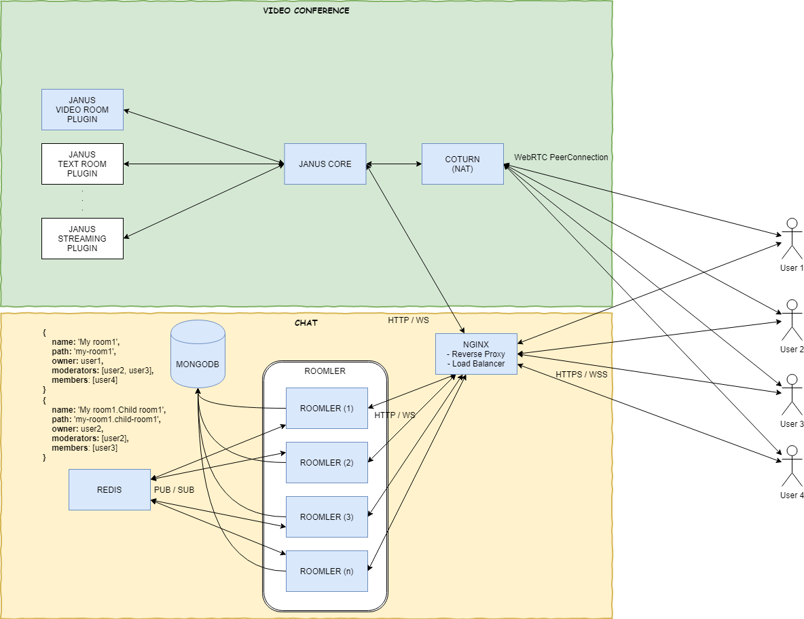

# Roomler

> Roomler.Live - Live video conferencing & collaboration tool using WebRTC (Janus Gateway)

It's like Slack on Crack and Microsoft Teams on Steroids.
All that fully free and open source. 


[](https://www.youtube.com/watch?v=lzHeRwVDfPQ)

# Features

| MULTI PARTY CALLS       | POWERFUL CHAT           | ORGANIZED ROOMS         |
|-------------------------|-------------------------|-------------------------|
| <ul><li>[x] Video</li><li>[x] Audio</li><li>[x] Screen share</li><li>[x] Encrypted</li><li>[x] up to 50 call participants</li></ul> | <ul><li>[x] Rich-text</li><li>[x] File sharing</li><li>[x] Emojis & Giphy's</li><li>[x] Mentions</li><li>[x] Reactions</li></ul> | <ul><li>[x] Public Rooms</li><li>[x] Private Rooms</li><li>[x] Hierarchy of Rooms</li><li>[x] User invite system</li><li>[x] Owner, moderator & member roles</li></ul> |

# Technology stack
- [Janus Gateway](https://github.com/meetecho/janus-gateway)
- [Coturn](https://github.com/coturn/coturn)
- [Fastify](https://github.com/fastify/fastify)
- [PM2](https://github.com/Unitech/pm2)
- [MongoDB](https://github.com/mongodb/mongo)
- [Redis](https://github.com/antirez/redis)
- [VueJS](https://github.com/vuejs/vue)
- [NuxtJS](https://github.com/nuxt/nuxt.js/)    
- [VuetifyJS](https://github.com/vuetifyjs/vuetify)
- [Tiptap](https://github.com/ueberdosis/tiptap)
- [ProseMirror](https://github.com/ProseMirror/prosemirror)
- [Nginx](https://github.com/nginx/nginx)
- [Docker](https://github.com/docker)

# Architecture


# Prerequisites

Roomler requires:
- docker engine being installed on your host machine
- two docker networks being created
- environment variables being setup
- serveral micro services up and running

before we can start Roomler (both in development and production environemnt)

## Docker network
Besides the default `host` Docker network, we need to create two addition bridge networks:
1. `docker network create frontend` (used by containers `roomler`, `nginx`)
2. `docker network create backend` (used by containers `roomler`, `mongo`, `redis`)
3. on the existing `host` network `janus` and `coturn` will be attached

## Microservice dependencies
- [Janus Gateway](docs/deps-janus.md)
- [Coturn](docs/deps-coturn.md)
- [MongoDB](docs/deps-mongo.md)
- [Redis](docs/deps-redis.md) - optional in development, but recommended in production!
- [Nginx](docs/deps-nginx.md) - optional in development, but recommended in production!

## Environment variables
You need to setup all your Required (even Optional if desired) [environment variables](docs/env.md), before you can run Roomler

# Start Roomler App

## Start in development mode

``` bash
# install dependencies
$ npm i

# Start API server (localhost:3001)
$ npm run dev:api

# Start UI server (localhost:3000)
$ npm run dev:ui
```

## Start in production mode

``` bash
# install dependencies
$ npm i

# build for production and launch server
$ npm run build
$ npm start
```

## Start in production mode using docker

### Docker build
`./build.sh`

### Docker release
`./release.sh`


### Docker run
``` bash
docker run -d --name roomler \
    --hostname roomler \
    --network backend \
    --restart always \
    -e API_URL=https://roomler.live \
    -p 8082:3000 \
    -e DB_CONN=YOUR_DB_CONN \
    -e WS_SCALEOUT_ENABLED=true \
    -e WS_SCALEOUT_HOST=redis \
    -e SENDGRID_API_KEY=YOUR_SEND_GRID_KEY \
    -e FACEBOOK_ID=YOUR_FACEBOOK_ID \
    -e FACEBOOK_SECRET=YOUR_FACEBOOK_SECRET \
    -e GOOGLE_ID=YOUR_GOOGLE_ID \
    -e GOOGLE_SECRET=YOUR_GOOGLE_SECRET \
    -e GITHUB_ID=YOUR_GITHUB_ID \
    -e GITHUB_SECRET=YOUR_GITHUB_SECRET \
    -e LINKEDIN_ID=YOUR_LINKEDIN_ID \
    -e LINKEDIN_SECRET=YOUR_LINKEDIN_SECRET \
    -e TURN_URL=YOUR_TURN_URL \
    -e TURN_USERNAME=YOUR_TURN_USERNAME \
    -e TURN_PASSWORD=YOUR_TURN_PASSWORD \
    -e GIPHY_API_KEY=YOUR_GIPHY_KEY \
    -e GOOGLE_ANALYTICS_ID=YOUR_GOOGLE_ANALYTICS_ID \
    -e SUPER_ADMIN_EMAILS='["your_super_admin_email@gmail.com"]' \
    -e WEB_PUSH_CONTACT="mailto: your_email@gmail.com" \
    -e WEB_PUSH_PUBLISH_KEY=YOUR_VAPID_PUBLIC_KEY \
    -e WEB_PUSH_PRIVATE_KEY=YOUR_VAPID_PRIVATE_KEY \
    -e NUXT_TELEMETRY_DISABLED=1 \
    gjovanov/roomler

# attach roomler container to backend network
docker network connect backend roomler
```

## Start in production mode using docker-compose
`docker-compose up` - this will start the whole docker stack of services


# Testing
## Run API tests

``` bash
# makes sure MongoDB is reachable based on /config/index.js (dbSettings)
$ npm run test:api
```

## Run E2E tests (TODO)

``` bash
# makes sure MongoDB is reachable based on /config/index.js (dbSettings)
# first start the API and UI servers in TEST envrionment
$ npm run start:test-e2e
# then run all E2E test
$ npm run test:e2e

```
